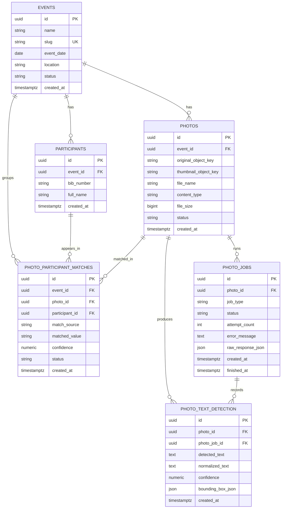

# Raceframe MVP Database Design

## What is a slug?

A `slug` is a URL-friendly unique text value used to identify something in links.

Example:

- Event name: `Bangalore City Marathon 2026`
- Slug: `bangalore-city-marathon-2026`

Why use it:

- cleaner URLs
- easier to read than numeric IDs
- good for public event pages

Example URL:

`/event/bangalore-city-marathon-2026`

For this MVP, `events.slug` should be unique.

## Scope

This MVP database design only includes these tables:

- `events`
- `participants`
- `photos`
- `photo_jobs`
- `photo_text_detection`
- `photo_participant_matches`

No auth or role tables are included yet. `admin`, `photographer`, and public `user` access are handled outside the database for now.

## ER Diagram

## Table Notes

### `events`

Purpose:
Stores each race/event.

Important fields:

- `id`: primary key
- `name`: event name
- `slug`: unique public identifier for URLs
- `event_date`: when the event happens
- `location`: optional place name
- `status`: usually `draft` or `published`
- `created_at`: creation time

Recommended constraint:

- unique on `slug`

### `participants`

Purpose:
Stores runners/participants for a specific event.

Important fields:

- `id`: primary key
- `event_id`: links participant to an event
- `bib_number`: bib assigned in that event
- `full_name`: participant name
- `created_at`: creation time

Recommended constraints:

- foreign key `event_id -> events.id`
- unique on `(event_id, bib_number)`

### `photos`

Purpose:
Stores uploaded race photos and their cloud object paths.

Important fields:

- `id`: primary key
- `event_id`: photo belongs to one event
- `original_object_key`: cloud storage path for original image
- `thumbnail_object_key`: cloud storage path for thumbnail
- `file_name`: original uploaded file name
- `content_type`: image MIME type
- `file_size`: image size in bytes
- `status`: example values `uploaded`, `processing`, `ready`, `failed`
- `created_at`: upload time

Recommended constraints:

- foreign key `event_id -> events.id`

### `photo_jobs`

Purpose:
Tracks processing work done on a photo, mainly OCR in MVP.

Important fields:

- `id`: primary key
- `photo_id`: photo being processed
- `job_type`: example `ocr`
- `status`: example `queued`, `processing`, `completed`, `failed`
- `attempt_count`: retry counter
- `error_message`: failure reason if any
- `raw_response_json`: OCR provider response for debugging
- `created_at`: job creation time
- `finished_at`: completion time

Recommended constraints:

- foreign key `photo_id -> photos.id`

### `photo_text_detection`

Purpose:
Stores raw or normalized text detected from a photo by OCR.

Important fields:

- `id`: primary key
- `photo_id`: photo where text was found
- `photo_job_id`: job that produced the detection
- `detected_text`: raw OCR output
- `normalized_text`: cleaned value, useful for bib matching
- `confidence`: OCR confidence if available
- `bounding_box_json`: optional region where text was found
- `created_at`: detection time

Recommended constraints:

- foreign key `photo_id -> photos.id`
- foreign key `photo_job_id -> photo_jobs.id`

### `photo_participant_matches`

Purpose:
Stores the final match between a photo and a participant.

Important fields:

- `id`: primary key
- `event_id`: copied here for easier filtering and integrity checks
- `photo_id`: matched photo
- `participant_id`: matched participant
- `match_source`: example `ocr`
- `matched_value`: example detected bib number
- `confidence`: match confidence
- `status`: example `auto_matched`, `verified`, `rejected`
- `created_at`: match creation time

Recommended constraints:

- foreign key `event_id -> events.id`
- foreign key `photo_id -> photos.id`
- foreign key `participant_id -> participants.id`
- unique on `(photo_id, participant_id)`

## Recommended Indexes

- `events(slug)`
- `participants(event_id, bib_number)`
- `participants(event_id, full_name)`
- `photos(event_id, status)`
- `photo_jobs(photo_id, status)`
- `photo_text_detection(photo_id)`
- `photo_participant_matches(event_id, participant_id)`
- `photo_participant_matches(photo_id)`

## Search Flow

Public user flow:

1. User opens an event page using the event `slug`.
2. User searches by bib number or participant name.
3. App finds the participant in `participants`.
4. App reads `photo_participant_matches`.
5. App fetches matching rows from `photos`.
6. App returns thumbnails and image links.

## MVP Notes

- Keep bib numbers unique only within an event, not globally.
- Keep cloud file paths in the database, but store actual image files in object storage.
- Keep OCR raw data for debugging, at least in MVP.
- Keep match rows separate from raw text detections. Detection is evidence; match is the decision.
